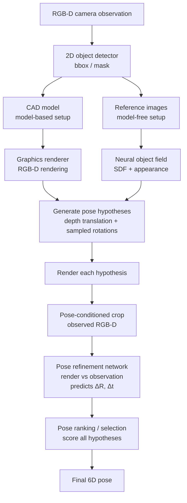

## Introduction

[Code](https://github.com/NVlabs/FoundationPose), [paper](https://arxiv.org/pdf/2312.08344)

<div style="text-align: center;">
<p align="center">
    <figure>
        
    </figure>
</p>
</div>

FoundationPose (CVPR 2024)

1. To reduce manual efforts for large scale training, it introduces a synthetic data generation pipeline by 3D model databases (GSO, Objaverse), large language models and diffusion models (Sec. 3.1). 
2. For pose estimation, it first initializes global poses uniformly around the object, which are then refined by the refinement network. Finally, it forwards the refined poses to the pose selection module which predicts their scores. The pose with the best score is selected as output
3. It also supports model-free mode with a small set of reference images we leverage an object-centric neural field (Sec. 3.2) for novel view RGBD rendering for subsequent renderand-compare. (Skipped in this article because we don't need it)



<div style="text-align: center;">
<p align="center">
    <figure>
        
    </figure>
</p>
</div>

### Step 2 Data Generation For Pose-Refinement and Scoring Networks

A foundation model means: a large, general-purpose model trained on a very large and diverse dataset, so it learns reusable 3D priors that transfer to many new objects and tasks.

FoundationPose is trained mostly on synthetic data. The authors use large 3D asset databases, including Objaverse and Google Scanned Objects, then augment object appearances using LLM-aided texture prompts and diffusion-based texture synthesis:

1. The system collects object assets from 3D model libraries such as >40,000 objects in Objaverse-LVIS and Google Scanned Objects. 1,156 LVIS categories are covered, each object has a category label, such as cup, bottle, box, and so on.
2. These category labels are then given to ChatGPT, allowing the large language model to automatically generate more specific appearance descriptions, such as: `“a green ceramic cup with cartoon patterns on its surface.”`.

    ```
    Objaverse-LVIS object category tag
            ↓
    ChatGPT generates appearance description
            ↓
    TexFusion receives:
        1. text prompt
        2. object shape
        3. randomly initialized noisy texture
            ↓
    TexFusion generates augmented textured 3D model
            ↓
    NVIDIA Isaac Sim renders synthetic RGB-D training data
    ```

3. These text prompts are then passed to a diffusion model / texture generation model, which generates more realistic and diverse textures for the original 3D objects.
4. Finally, the system uses a physics simulation and rendering engine (Isaac Sim) to randomly generate RGB-D images under different lighting conditions, viewpoints, backgrounds, materials, and occlusions. At the same time, it automatically obtains accurate ground-truth annotations, including 6D pose, depth maps, segmentation masks, and 2D bounding boxes.

<div style="text-align: center;">
<p align="center">
    <figure>
        
    </figure>
</p>
</div>


## Step 3 Pose initialization 

FoundationPose starts with many rough pose guesses.

Mental model:

“Before precise matching, scatter many possible poses around the object. Some guesses will be bad, but at least a few should be close enough for refinement.”

For translation, they use the median depth inside the detected 2D bounding box to estimate an initial 3D position. For rotation, they uniformly sample viewpoints from an icosphere around the object and add discretized in-plane rotations. 

```
def initialize_global_poses(bbox, depth):
    center_3d = median_depth_point_inside_bbox(bbox, depth)

    rotations = []
    for viewpoint in sample_icosphere_viewpoints():
        for roll in discrete_inplane_rotations():
            rotations.append(compose(viewpoint, roll))

    poses = []
    for R in rotations:
        poses.append(Pose(R=R, t=center_3d))

    return poses
```

## Step 4: Render-and-compare refinement

“Show the network two images: what I expected to see under this pose, and what the camera actually sees. The network predicts how to move the object pose so the two align better.”
For each coarse pose hypothesis:

Render the object at that pose.
Crop the observed RGB-D image around where that pose predicts the object should appear.
Feed rendered RGB-D and observed RGB-D into a neural refiner.
Predict a small pose update.

The paper says the refinement network takes the rendering conditioned on the coarse pose and a crop of the camera observation, then outputs a pose update that improves pose quality.

```
def refine_pose(pose, rgb, depth, object_representation):
    rendered = render(object_representation, pose)

    observed_crop = pose_conditioned_crop(
        rgb=rgb,
        depth=depth,
        pose=pose,
        object_size=object_diameter,
    )

    delta_R, delta_t = refinement_network(rendered, observed_crop)

    new_pose = apply_pose_update(pose, delta_R, delta_t)
    return new_pose
```

## Step 5: Pose-conditioned crop


A simpler method would always crop using the detector bounding box. FoundationPose instead crops based on the current pose hypothesis: project the object origin into image space, estimate the projected object diameter, and crop around that.

Mental model:

“The crop itself should tell the network whether the current pose is shifted too far left, right, up, down, near, or far.”

Why this matters:

If the crop is fixed from the detector box, translation errors are partially hidden.
If the crop follows the pose hypothesis, bad translation causes misalignment inside the crop.
The refiner can then learn: “the rendered object is left of the real object, so update translation right.”

Pseudo-code:

```
def pose_conditioned_crop(rgbd, pose, object_diameter):
    crop_center = project_object_origin(pose)
    crop_size = project_object_diameter(pose, object_diameter)
    return crop(rgbd, center=crop_center, size=crop_size)
```

## Refinement network architecture

“The CNN extracts local visual alignment cues; the transformer lets different regions of the rendered/observed comparison talk to each other globally.” The refiner has two RGB-D branches:

```
rendered RGB-D branch     observed RGB-D branch
          ↓                         ↓
      shared CNN encoder       shared CNN encoder
          ↓                         ↓
        feature maps concatenated
          ↓
        residual CNN blocks
          ↓
        patch/token representation
          ↓
        transformer encoder
          ↓
   predict translation update + rotation update
```

## Disentangled pose update

Instead of predicting one monolithic SE(3) transform, FoundationPose predicts rotation and translation updates separately in the camera frame. The authors say this removes dependence on the updated orientation when applying translation and simplifies learning.

Mental model:

“Predict ‘rotate this much’ and ‘shift this much’ as two separate corrections, both expressed in the camera coordinate system.”

This matters because rotation and translation interact. If translation is expressed in object coordinates, then a rotation change can change what the translation means. Expressing both updates in the camera frame makes the target easier for the network to learn.

Simplified pseudo-code:


```
delta_t_cam, delta_R_cam = network(rendered, observed)

t_new = t_old + delta_t_cam
R_new = delta_R_cam @ R_old
```

## Pose selection / ranking

After refinement, FoundationPose may still have many candidate poses. It needs to choose the best one.

Mental model:

“Each refined pose renders a possible explanation of the image. Score all explanations, compare them against each other, and choose the most plausible one.”

The pose selection module uses a hierarchical ranking network:

Compare each rendered pose against the observed crop.
Produce an embedding describing alignment quality.
Use self-attention across all pose hypotheses.
Output a score for each pose.
Pick the highest-scoring pose.

The paper says the ranking network first compares each hypothesis rendering to the observation, then performs a second-level comparison among all pose hypotheses using multi-head self-attention, allowing it to use global context instead of assigning isolated absolute scores.

```
def select_best_pose(poses, rgb, depth, object_representation):
    embeddings = []

    for pose in poses:
        rendered = render(object_representation, pose)
        observed_crop = pose_conditioned_crop(rgb, depth, pose)
        e = pair_encoder(rendered, observed_crop)
        embeddings.append(e)

    # Compare all hypotheses jointly
    contextual_embeddings = self_attention_over_hypotheses(embeddings)

    scores = linear_score_head(contextual_embeddings)

    return poses[argmax(scores)]
```

## Tracking workflow

For tracking, FoundationPose does not need to globally sample many poses every frame.

Mental model:

“Once I know the pose in frame t−1, the pose in frame t is probably nearby. Use the previous pose as the initial hypothesis and refine it.”

Pseudo-code:

```
pose = estimate_pose_first_frame(rgb0, depth0)

for rgb_t, depth_t in video:
    rendered = render(object_representation, pose)
    observed_crop = pose_conditioned_crop(rgb_t, depth_t, pose)

    delta_R, delta_t = refinement_network(rendered, observed_crop)

    pose = apply_pose_update(pose, delta_R, delta_t)
```

This is why tracking is much faster than single-frame pose estimation. The paper reports single-object pose estimation taking about 1.3 seconds, while tracking runs at 32 Hz because it only needs refinement and not many global hypotheses.

The paper says it extracts feature maps from two RGB-D input branches using a shared CNN encoder, concatenates the features, tokenizes them into patches with positional embeddings, then uses transformer encoders to predict translation and rotation updates.

如果有 CAD 模型，就直接渲染候选位姿；如果没有 CAD，只给少量参考图像，就先训练一个 object-centric neural field 来渲染新视角 RGB-D 图像。之后无论是 CAD 渲染还是 neural field 渲染，都会进入同一个 render-and-compare 位姿估计框架：先在物体周围均匀初始化一批全局位姿假设，再用 refinement network 逐步修正这些候选位姿，最后用 pose selection module 给每个 refined pose 打分，选择分数最高的位姿作为最终输出。

- what does foundation model meann in "Zero123-XL. Using Objaverse-XL, we train Zero123-XL, a foundation model for 3D, observing incredible 3D generation abilities.  " TODO


TODO: 3D point cloud -> CAD
TODO: How to setup texfusion


## Appendix 

- [Objaverse-XL](https://objaverse.allenai.org/): "A Universe of 10M+ 3D Objects". (Zero123-XL transforms single image into 3D model using Dreamfusion. )

<div style="text-align: center;">
<p align="center">
    <figure>
        
    </figure>
</p>
</div>

- [GSO](https://research.google/blog/scanned-objects-by-google-research-a-dataset-of-3d-scanned-common-household-items/): 1032 3D importable objects for Gazebo