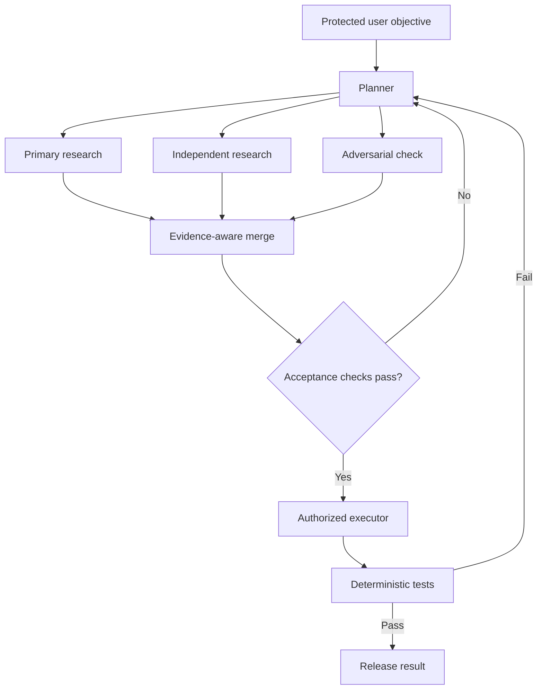

# Graph Engineering for AI Agents: Increasing Certainty by Bounding Autonomy

As models become more capable, the hard problem is no longer simply getting an agent to do something. It is getting the agent to do the **intended** thing, preserve the original objective, use trustworthy evidence, and stop when the evidence is insufficient.

- Goal drift and context decay: As the interaction grows, the original objective becomes buried. The agent may gradually reinterpret the task and move farther away from what the user initially requested.
- Proxy optimization: An agent can quietly replace a difficult goal with an easier proxy. It may produce a polished answer, pass its own informal review, and declare success while the original problem remains unresolved. Google DeepMind documented this pattern as specification gaming.
- Self-evaluation: A single agent is both the athlete and the judge. Once it makes an error or adopts a flawed assumption, the same reasoning process may struggle to recognize and correct it.
- Tool overload: As the toolset grows, selecting the correct tool—and using it with the appropriate authority—becomes increasingly difficult.
- Coarse task routing: A single agent cannot easily route different parts of a problem to models or tools with different capabilities, costs, or permissions.
- Poor observability: When something goes wrong, it can be difficult to determine whether the cause was faulty reasoning, missing context, unreliable evidence, incorrect routing, tool misuse, or a bad completion criterion.

An agent can quietly replace a difficult goal with an easier proxy. It may produce a polished answer, pass its own informal review, and declare success while the original problem remains unresolved. [Google DeepMind documented this pattern](https://deepmind.google/blog/specification-gaming-the-flip-side-of-ai-ingenuity/) long before today's tool-using agents.
A general-purpose agent often plays several conflicting roles:

- It interprets the request.
- It chooses the plan.
- It performs the work.
- It decides whether the work is correct.
- It declares the task complete.

It is both the athlete and the referee. The failure is broader than hallucinating facts. The agent may experience **goal drift**: later reasoning gradually replaces the user's original objective with a nearby, easier objective. It can then evaluate its answer against the substituted goal and approve itself.

We therefore need more than better prompts. We need systems that bound what models may decide, remember, change, and approve. People call this **graph engineering**: designing structure with **more certainty** around agents so that objectives, authority, evidence, state transitions, and completion criteria are explicit. A graph lets the surrounding system own what the model should not be trusted to redefine:

- Store the original objective in protected state.
- Require explicit approval to alter that objective.
- Give different nodes different tools and write permissions.
- Compare the final result with the original acceptance criteria.
- Preserve evidence and traces so failures can be inspected.

## 1 - A graph is more than a picture of agents

The term *graph engineering* is not yet standardized. The industry more often uses *agent orchestration*, *multi-agent architecture*, or *stateful workflow*. The underlying design pattern, however, is becoming clear across recent agent frameworks.

A technically precise description starts with an ordinary directed graph, where:

- $V$ contains agents, tools, deterministic functions, data stores, evaluators, and human approval points.
- $E$ contains the allowed transitions between those nodes.
- $S$ is state: the objective, plan, evidence, memory, artifacts, budgets, and current status.
- $P$ is policy: who may route work, call tools, write data, create agents, or modify the graph.
- $C$ is the set of checks and acceptance criteria.
- $H$ is execution history: checkpoints, traces, tool results, approvals, and failures.

This distinction matters. **Edges are not shared state.** An edge says where execution may go next. State is the information read or changed during that transition. A conditional edge may inspect state—for example, `tests_passed == true`—before selecting the next node.

## 2 - Fan-out and fan-in: parallelism with a purpose

A common graph pattern is fan-out followed by fan-in:

$$
\text{query}\rightarrow\text{planner}\rightarrow
\begin{cases}
\text{task A}\rightarrow\text{worker A}\\
\text{task B}\rightarrow\text{worker B}\\
\text{challenge}\rightarrow\text{reviewer}
\end{cases}
\rightarrow\text{integration}
$$

For research, a lead agent might create a plan, store it in memory, launch several search agents in parallel, integrate their findings, and then send the draft to a citation checker. Anthropic describes this orchestrator–worker pattern in its [production multi-agent research system](https://www.anthropic.com/engineering/multi-agent-research-system): a lead researcher delegates parallel searches, synthesizes the findings, and hands the report to a separate citation agent.

Fan-out improves speed and coverage when the branches are genuinely separable. It does **not** automatically increase certainty. Three agents repeating the same search with the same model and assumptions produce correlated confidence, not independent evidence.

Useful branches should have distinct jobs, such as:

- find primary sources supporting the claim;
- actively search for contradictory evidence;
- verify dates, numbers, and citations;
- identify missing requirements or untested assumptions.

The fan-in node must do more than concatenate answers. It should preserve provenance, expose conflicts, detect duplicated evidence, and mark unresolved questions. Consensus without independence is not verification.

This is also why multi-agent systems are not universally better. Anthropic reports that its design works especially well for breadth-first research but consumes substantially more tokens and is a poor fit when workers require the same full context or have many dependencies. A [2025 empirical study comparing single- and multi-agent systems](https://arxiv.org/abs/2505.18286) likewise found that the advantage of multi-agent designs can shrink as the underlying model becomes stronger. The right default is therefore the simplest architecture that meets the reliability target.

## 3 - Separate generation from evaluation

Another useful pattern is an evaluator–optimizer loop:

$$
\text{candidate}\rightarrow\text{evaluator}\rightarrow
\begin{cases}
\text{accept}\\
\text{revise with feedback}\\
\text{escalate}
\end{cases}
$$

The optimizer produces a candidate. The evaluator compares it with fixed criteria. If it fails, the evaluator returns specific evidence and the optimizer tries again.

The separation is useful, but a second LLM is still a probabilistic judge. It may approve fluent nonsense, inherit the optimizer's assumptions, or gradually relax the rubric. The strongest evaluator depends on the kind of requirement:

| Requirement | Strongest practical evaluator |
|---|---|
| Code compiles | Compiler |
| API response follows a contract | Schema or type validator |
| Behavior is preserved | Unit and regression tests |
| Performance meets a target | Reproducible benchmark |
| Database invariants hold | Queries and constraint checks |
| Research claims match sources | Source inspection, then model or human review |
| Writing is clear or persuasive | Rubric-based model or human judgment |

The principle is straightforward:

> Use models for judgment where judgment is unavoidable. Use code where correctness can be computed.

Once a requirement has been converted into a reliable check, the agent should not be allowed to rewrite or waive it. Tests, benchmarks, schemas, and permission checks belong to the system's control plane, not inside the model's negotiable context.

Evaluator loops also need hard limits: maximum iterations, cost budgets, stopping rules, and an escalation path. Otherwise, two agents can spend indefinitely optimizing against an unreliable judge.

## 4 - Control the authority graph

The most important graph may be the authority graph rather than the reasoning graph.

Different nodes should receive only the capabilities required for their role:

- Search agents may read external sources but cannot modify production data.
- Citation agents may verify claims but cannot rewrite source evidence.
- Coding agents may propose patches in a sandbox but cannot deploy them.
- Test nodes may execute checks but cannot waive failures.
- Release nodes may write or deploy only after required gates pass.
- Only a trusted policy layer—or a human—may expand permissions or modify the graph itself.

This is least privilege applied to agent systems. It bounds the damage from hallucination, prompt injection, goal drift, and ordinary software bugs. It also creates accountability: we can inspect which node acted, with what evidence, under which authority, and after which approvals.

Policies should govern at least four mutation types:

1. **State mutation:** who may change objectives, evidence, status, or artifacts?
2. **World mutation:** who may write code, databases, messages, or production systems?
3. **Topology mutation:** who may create agents or add new routes?
4. **Policy mutation:** who may grant permissions or weaken checks?

The last two should be much more restricted than ordinary task execution. An agent that can change its own graph and its own rules is not meaningfully bounded.

## Why this feels recent

The individual ideas—directed graphs, state machines, least privilege, checkpoints, testing, and separation of duties—are old. What is recent is their convergence around probabilistic, tool-using agents:

- [LangGraph](https://docs.langchain.com/oss/python/langgraph/graph-api) exposes nodes, edges, shared state, conditional routing, reducers, and subgraphs. Its [persistence layer](https://docs.langchain.com/oss/python/langgraph/persistence) checkpoints thread state and separates short-term graph state from longer-term stores.
- LangGraph's [time-travel support](https://docs.langchain.com/oss/python/langgraph/use-time-travel) can replay or fork execution from a prior checkpoint, which is valuable for debugging and fault recovery.

Checkpointing and “time travel” improve resumability, debugging, and fault tolerance. They do not prove that the saved reasoning was correct. A perfectly replayable mistake is still a mistake.

Start with the simplest solution that might work. A single model call with retrieval and deterministic checks may outperform a complex multi-agent system on cost, latency, and reliability. Add a node or edge only when it targets an observed failure mode.

A practical development loop is:

1. Define the intended end state and unacceptable failures.
2. Build a small benchmark from real tasks.
3. Establish a single-agent baseline.
4. Trace failures: goal drift, missing evidence, bad routing, unsafe actions, context loss, or poor recovery.
5. Add the smallest structural control that targets the dominant failure.
6. Re-run the same benchmark and measure quality, cost, latency, and variance.
